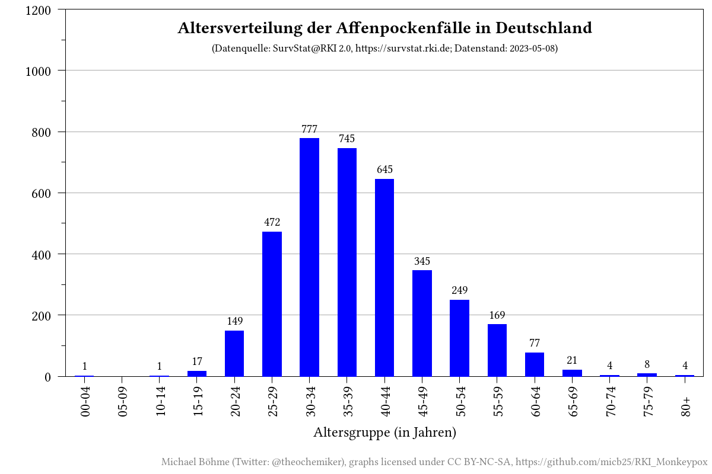
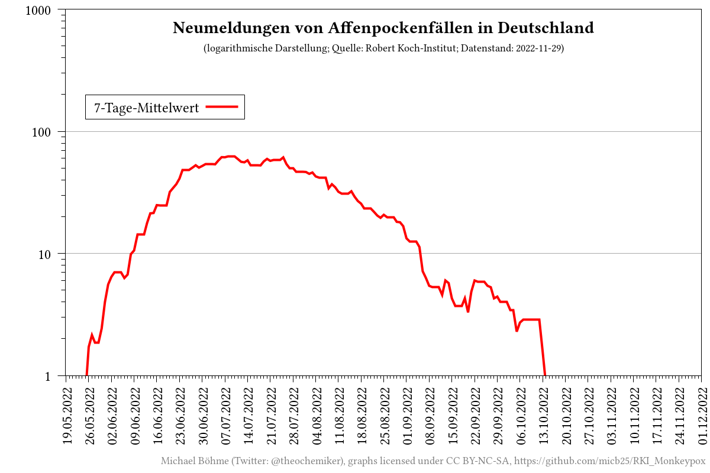
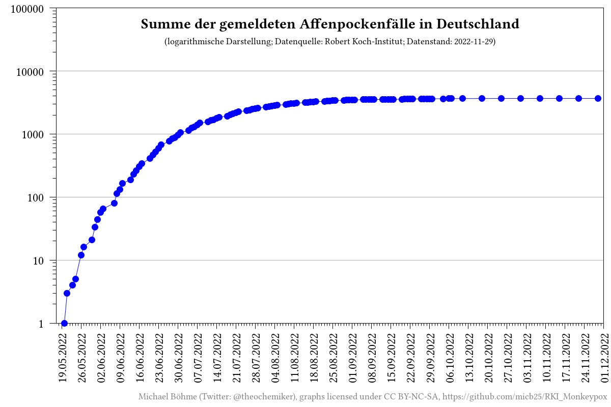
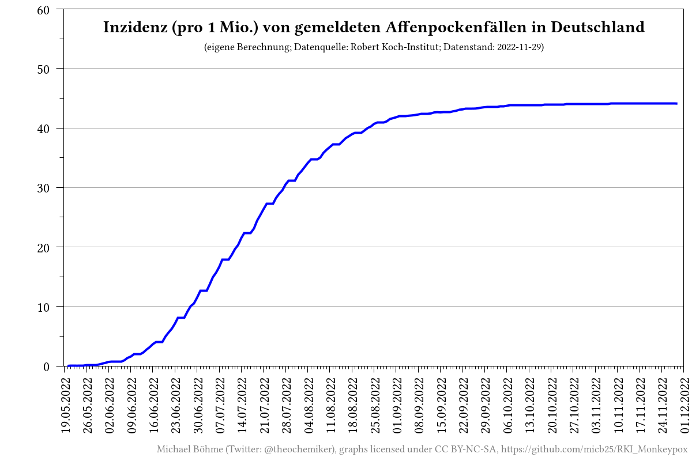
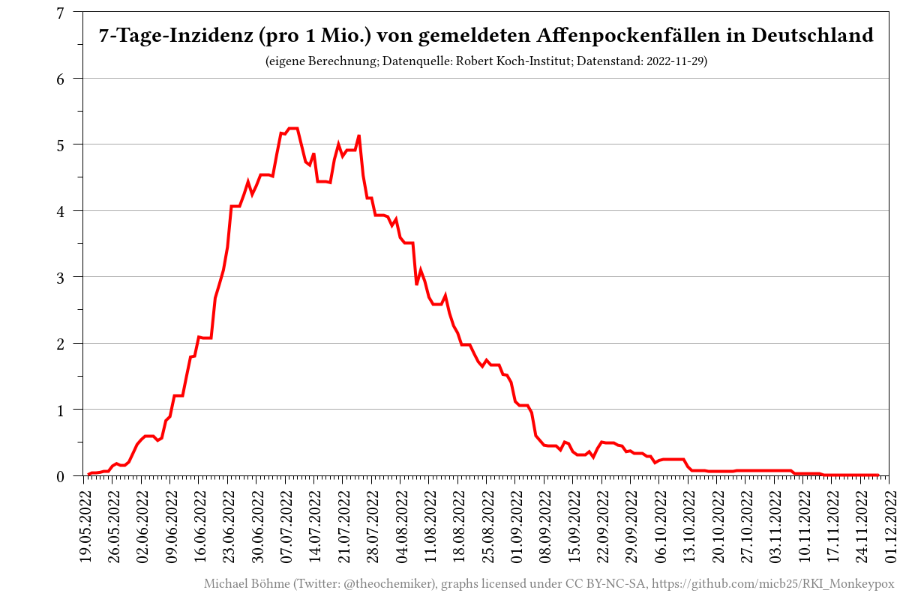

# RKI_Monkeypox

_[English version](README.md)_

## Beschreibung

Dieses Repository sammelt automatisiert die aktuellen Meldezahlen zum Affenpockenausbruch in Deutschland von den Seiten des Robert Koch-Instituts (RKI) und stellt die gesammelten Daten grafisch dar.

## Interaktive Webseite
- [https://micb25.github.io/RKI_Monkeypox](https://micb25.github.io/RKI_Monkeypox)

## Daten
- [prozessierte CSV-Daten](data/RKI_Monkeypox_processed.csv)
- [prozessierte CSV-Daten nach Altersgruppe](data/RKI_Monkeypox_processed_age_groups.csv)
- [prozessierte CSV-Daten nach Bundesland](data/RKI_Monkeypox_processed_states.csv)
- [gesammelte CSV-Rohdaten pro Kreis](data/RKI_SurvStat_by_date_and_district/)
- [gesammelte CSV-Rohdaten](data/RKI_Monkeypox.csv)
- [manuell gesammelte CSV-Daten vom Twitterkanal des RKIs](data/RKI_Monkeypox_Twitter.csv)

## Datenquellen
- [Robert Koch-Institut (RKI)](https://www.rki.de/DE/Content/InfAZ/A/Affenpocken/Ausbruch-2022-Situation-Deutschland.html)
- [SurvStat@RKI 2.0, https://survstat.rki.de](https://survstat.rki.de)

## Visualisierungen

## Mitwirkende

