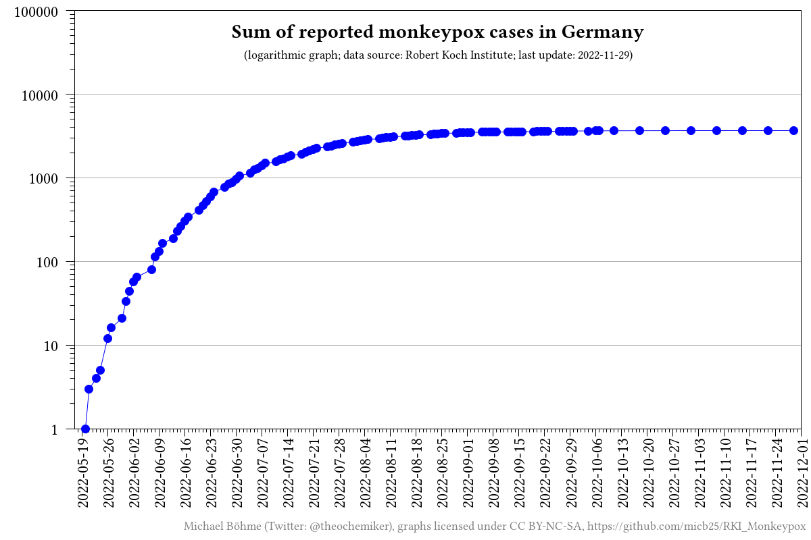
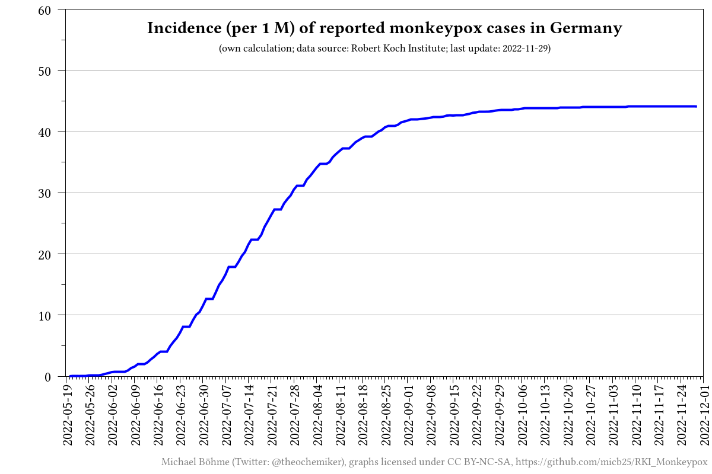

# RKI_Monkeypox

_[Deutsche Fassung](README.de.md)_

## Description

This repository automatically scrapes and collects the current case numbers for the monkeypox outbreak in Germany from the Robert Koch Institute (RKI) website and visualizes the collected data.

## Data
- [processed data (CSV)](data/RKI_Monkeypox_processed.csv)
- [scraped raw data (CSV)](data/RKI_Monkeypox.csv)

## Source
- [Robert Koch-Institut (RKI)](https://www.rki.de/DE/Content/InfAZ/A/Affenpocken/Ausbruch-2022-Situation-Deutschland.html)

## Figures

## Contributors

