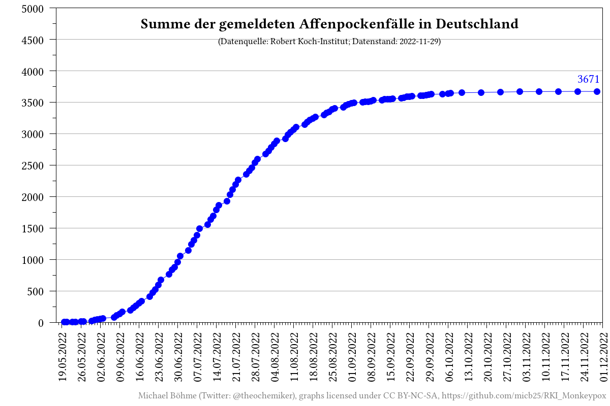

# RKI_Monkeypox

## Beschreibung

Dieses Repository sammelt automatisiert die aktuellen Meldezahlen zum Affenpockenausbruch in Deutschland von den Seiten des Robert Koch-Instituts (RKI) und stellt die gesammelten Daten grafisch dar.

## Daten

## Datenquelle
- [Robert Koch-Institut (RKI)](https://www.rki.de/DE/Content/InfAZ/A/Affenpocken/Ausbruch-2022-Situation-Deutschland.html)

