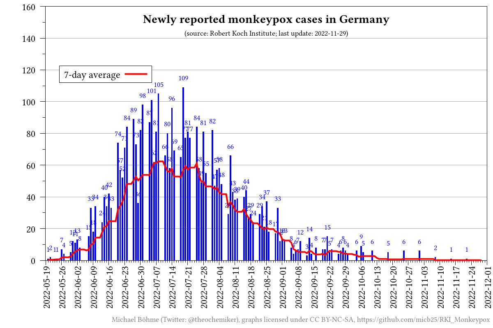
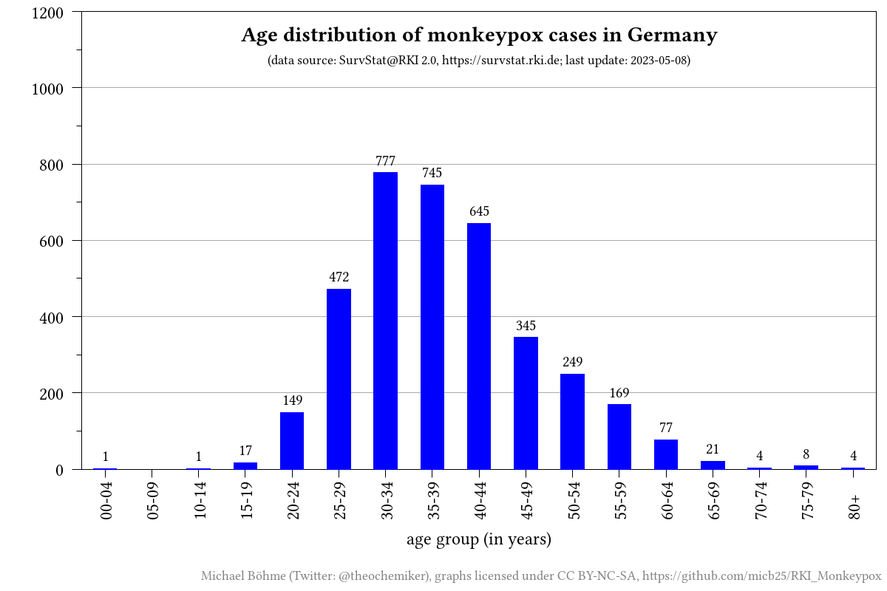
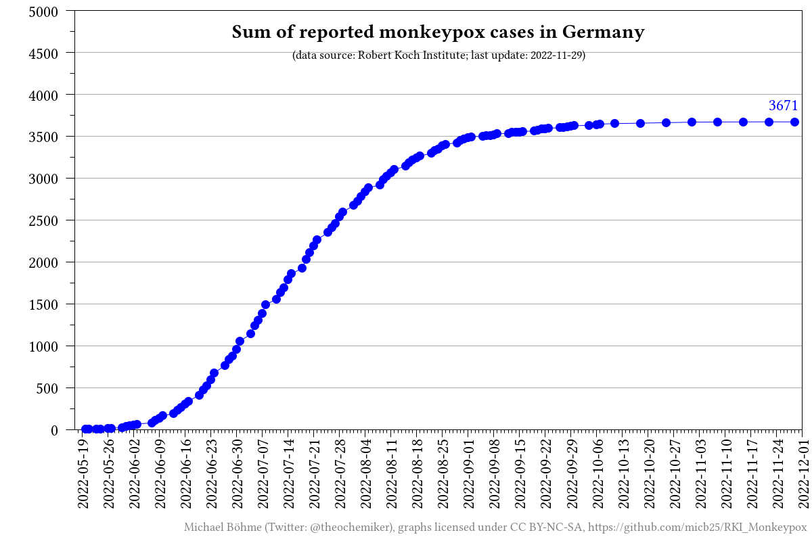
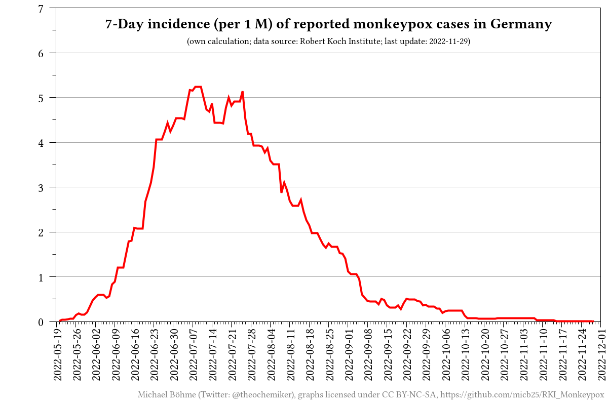

# RKI_Monkeypox

_[Deutsche Fassung](README.de.md)_

## Description

This repository automatically scrapes and collects the current case numbers for the monkeypox outbreak in Germany from the Robert Koch Institute (RKI) website and visualizes the collected data.

Interactive website: [https://micb25.github.io/RKI_Monkeypox](https://micb25.github.io/RKI_Monkeypox)

## Data
- [processed data (CSV)](data/RKI_Monkeypox_processed.csv)
- [processed data (CSV) per age group](data/RKI_Monkeypox_processed_age_groups.csv)
- [processed data (CSV) per state](data/RKI_Monkeypox_processed_states.csv)
- [scraped raw data (CSV) per district](data/RKI_SurvStat_by_date_and_district/)
- [scraped raw data (CSV)](data/RKI_Monkeypox.csv)
- [manually scraped data from RKI on Twitter (CSV)](data/RKI_Monkeypox_Twitter.csv)

## Sources
- [Robert Koch-Institut (RKI)](https://www.rki.de/DE/Content/InfAZ/A/Affenpocken/Ausbruch-2022-Situation-Deutschland.html)
- [SurvStat@RKI 2.0, https://survstat.rki.de](https://survstat.rki.de)

## Figures

## Contributors

